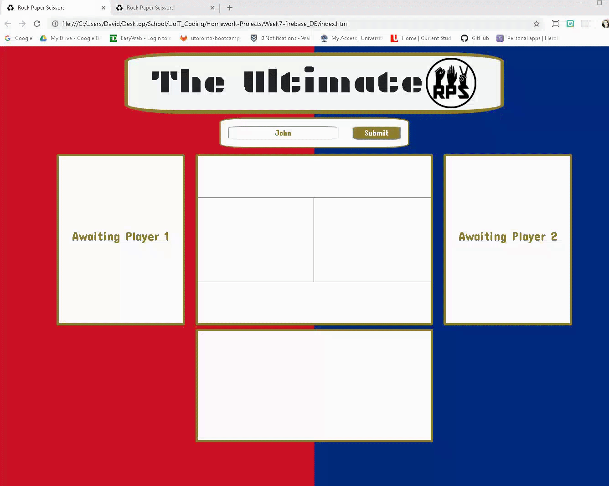

# Rock Paper Scissors MultiPlayer

## Description
Classic 'Rock Paper Scissors' brought to life in a web-based application. By including a 'multiplayer' feature, this project was intended to act as a precursor to implementing user authentication. When a user vistis the page, they are either displayed a 'waiting to join' screen or an 'occupied' screen. If there is space available than they may join and face other live users. 

## Screenshots

## Motivation
Data persistency is a core feature of any software application, and firebase is an excellent resource for incorporating such abilities into one's application. By setting up a noSQL JSON-based database, I was able to read and write game-data, user information, and scores. This was especially useful for implementing the 'chat' feature of the app, where users can have live conversations as they face off in Rock Paper Scissors.

## Technology Used
* HTML
* CSS
* Javascript
* Jquery
* Firebase Database as a service

## Resolutions
On difficulty I had when first starting this program was getting the browser to display specific information for each specific player. To solve this I created an 'active player' value that was populated when the user chooses their charatcer's name. I then used this value to determine what to show on the browser, allowing for personalized data on the screen. 
 
## Instructions
* Start as Player 1 and wait for another player, or if Player 1 exists, then start as Player 2 and begin right away 
* Play rock paper scissors while the game counts your wins, losses, and ties. 
* Send messages your opponenet during the game with the personalzed message board
* If your opponent leaves, you can remain in the game and wait for another player to join 
* If you load the page when Player 1 and 2 are active then just wait and refresh the page. Once one leaves the 'join' screen will show

